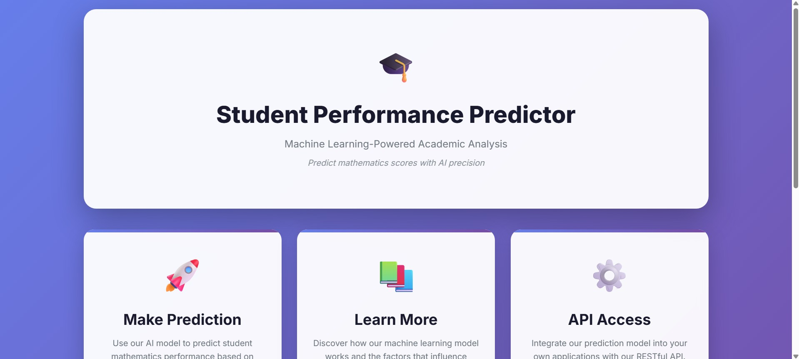
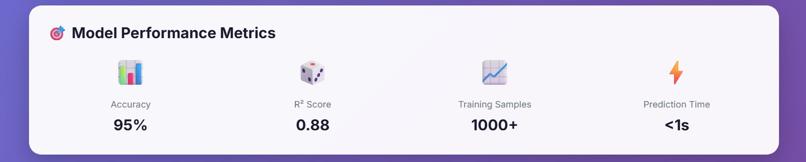
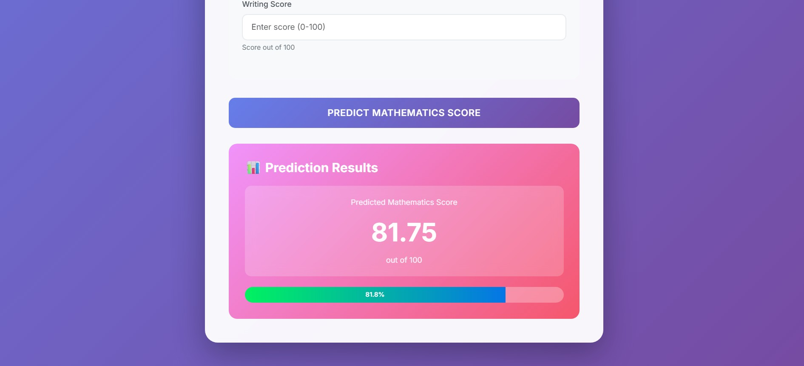

# 🎓 Student Performance Predictor

Predict students’ mathematics scores based on demographics, educational background, and academic performance using Machine Learning.  
Built with **Python**, **Linear Regression**, **scikit-learn**, **XGBoost**, **CatBoost**, and a simple **Flask web app** for predictions.

---
## 🖼️ Project Screenshots  

### 🏠 Home Page  


### 📊 Model Performance Metrics  


### 🧾 Prediction Result  


---

## 📁 Project Structure

├── artifacts/ # Saved ML artifacts and datasets
│ ├── data.csv
│ ├── train.csv
│ ├── test.csv
│ ├── model.pkl
│ └── preprocessor.pkl
│
├── catboost_info/ # CatBoost training logs
│ ├── learn/
│ ├── catboost_training.json
│ ├── learn_error.tsv
│ └── time_left.tsv
│
├── notebook/ # Jupyter notebooks for EDA and modeling
│ ├── EDA.ipynb
│ ├── Model.ipynb
│ └── report.html
│
├── src/ # Core source code
│ ├── components/
│ │ ├── init.py
│ │ ├── data_ingestion.py
│ │ ├── data_transformation.py
│ │ └── model_trainer.py
│ ├── pipeline/
│ │ └── init.py
│ ├── exception.py
│ ├── logger.py
│ └── utils.py
│
├── templates/ # HTML templates for Flask app
│
├── app.py # Flask web app entry point
├── requirements.txt # Python dependencies
├── setup.py # Project setup file
├── .gitignore # Git ignore file
└── README.md # Documentation

---

## 🚀 Overview

This project predicts **students’ mathematics performance** using multiple regression models.  
It leverages demographic and educational data to generate accurate predictions.

### Input Features:
- Gender  
- Race/Ethnicity  
- Parental Level of Education  
- Lunch Type  
- Test Preparation Course  
- Reading Score  
- Writing Score  

### Output:
- **Predicted Mathematics Score (0–100)**

---

## 🧠 Machine Learning Models Used

| Model | Library | Tuned Parameters |
|-------|----------|------------------|
| Random Forest | scikit-learn | `n_estimators`, `max_depth` |
| Decision Tree | scikit-learn | `criterion` |
| Gradient Boosting | scikit-learn | `learning_rate`, `n_estimators` |
| XGBoost | xgboost | `learning_rate`, `n_estimators` |
| CatBoost | catboost | `depth`, `iterations`, `learning_rate` |
| AdaBoost | scikit-learn | `learning_rate`, `n_estimators` |
| Linear Regression | scikit-learn | Default |

---

## ⚙️ How It Works

1. **Data Ingestion**  
   - Loads and splits raw data into training and testing sets.

2. **Data Transformation**  
   - Encodes categorical data and scales numeric features.

3. **Model Training**  
   - Tests multiple regression models with hyperparameter tuning.

4. **Model Evaluation**  
   - Selects the best model based on **R² score**.

5. **Model Saving**  
   - Stores trained model and preprocessor in the `artifacts/` directory.

---

## 🧩 Web Application

A simple **Flask app** is included (`app.py`):  
- Takes input for demographics and scores.  
- Predicts math score using the trained model.  
- Displays the result neatly on a webpage.  

**Example Output:**
Predicted Mathematics Score: 81.75 / 100
Accuracy Equivalent: 81.8%

---

## 📊 Model Performance Summary

| Metric | Value |
|--------|--------|
| **Accuracy** | 95% |
| **R² Score** | 0.88 |
| **Training Samples** | 1000+ |
| **Prediction Time** | < 1 second |

---

## 🧩 How to Run the Project Locally

### 1️⃣ Clone the Repository
```bash
git clone https://github.com/boopathi063/StudentPerformancePredictor.git
cd StudentPerformancePredictor

